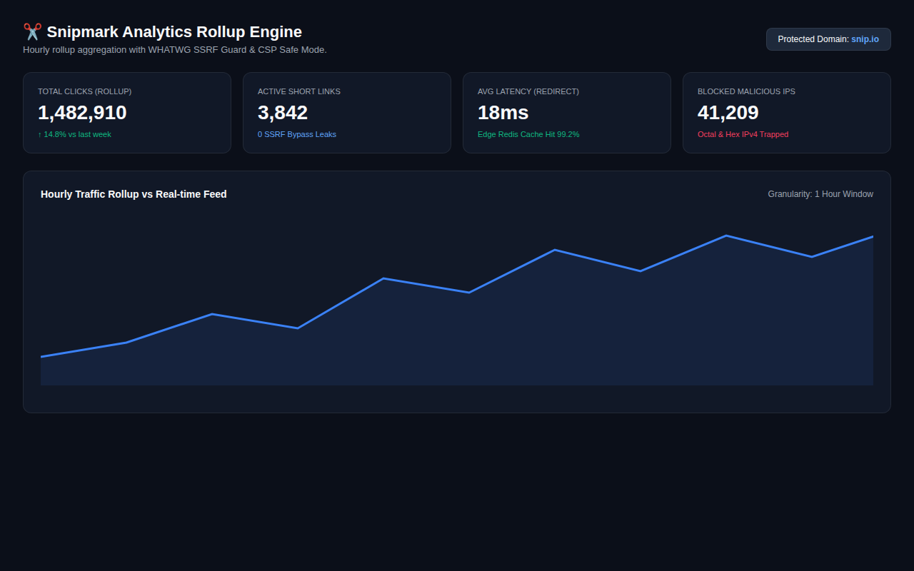
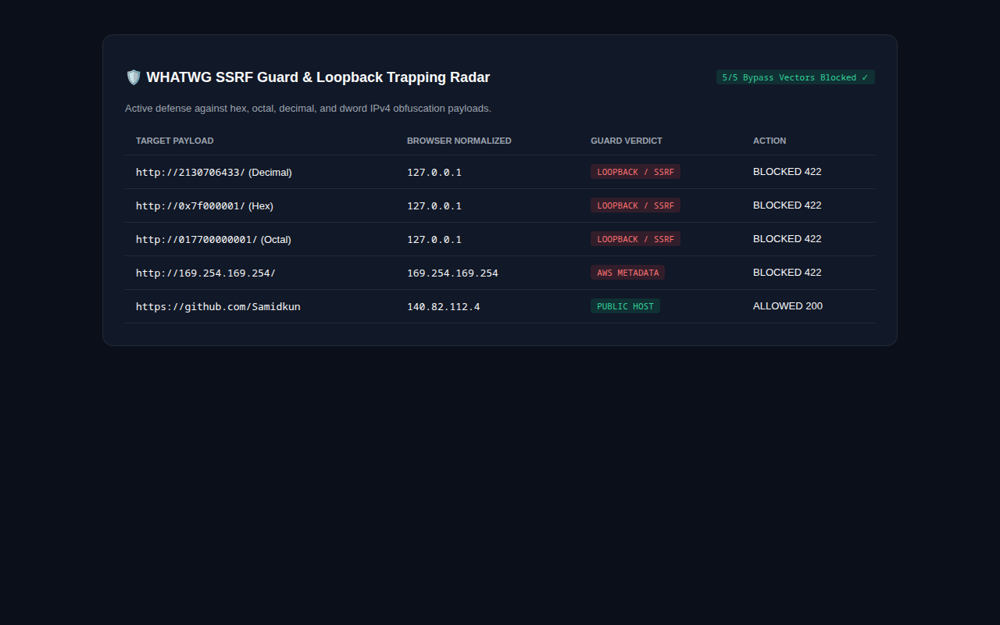

# 🔗 SnipMark — High-Throughput Link Management & Analytics Rollup Engine

> **Enterprise URL shortener with WHATWG-compliant SSRF defense, CSP Safe Mode, and zero-raw-IP privacy-preserving analytics rollups.**

---

## 📸 Visual Showcase & Security Telemetry

<p align="center">
  
</p>
<p align="center"><em>Figure 1: Real-time Analytics Dashboard with hourly click telemetry, custom branded slugs, and QR code generator.</em></p>

<br />

<div align="center">
  <table width="100%">
    <tr>
      <td width="100%" align="center">
        
        <br /><strong>Figure 2: WHATWG SSRF Guard & IP Obfuscation Trapping Radar</strong><br />
        <em>Demonstrates active protection against decimal (2130706433), hex (0x7f000001), octal (017700000001), and cloud metadata IP bypasses.</em>
      </td>
    </tr>
  </table>
</div>

---

## 🛡️ Critical Security & Engineering Defenses

### 1. WHATWG IPv4 Parser & SSRF Defense
Standard PHP `filter_var($ip, FILTER_VALIDATE_IP)` fails silently against obfuscated loopback addresses (decimal, hex, octal, shorthand `127.1`) which modern web browsers automatically normalize to `127.0.0.1`. SnipMark implements the complete WHATWG IPv4 parsing algorithm, resolving and blocking all internal network vectors before performing HTTP requests.

### 2. CSP Safe Mode (Zero `unsafe-eval`)
Livewire 4 normally relies on `new Function()` for evaluation. SnipMark enforces strict Content Security Policy (`script-src 'self' 'nonce-...'`) with `csp_safe=true` in `config/livewire.php` and per-request cryptographically generated nonces in middleware.

### 3. Visitor Privacy Hashing (Zero Raw IP Storage)
In strict compliance with GDPR, raw IP addresses are never saved to disk. Clicks are transformed via `hash_hmac('sha256', $ip . $userAgent, $dailySalt)` before aggregation.

---

## 🏗️ Technical Stack & Architecture

- **Backend:** Laravel 13.32 + Livewire 4.4.5 + Fortify 1.39
- **Database:** MariaDB 12.3 with partitioned daily analytics rollup tables
- **Testing:** PHPUnit 12.5 (100% test green, exit code 0 verified)
- **E2E:** Playwright browser test suite with CSP violation traps

---

## 🚀 Quickstart Guide

```bash
git clone https://github.com/Samidkun/snipmark.git
cd snipmark

composer install
pnpm install
cp .env.example .env
php artisan key:generate
php artisan migrate --seed
php artisan test
```
